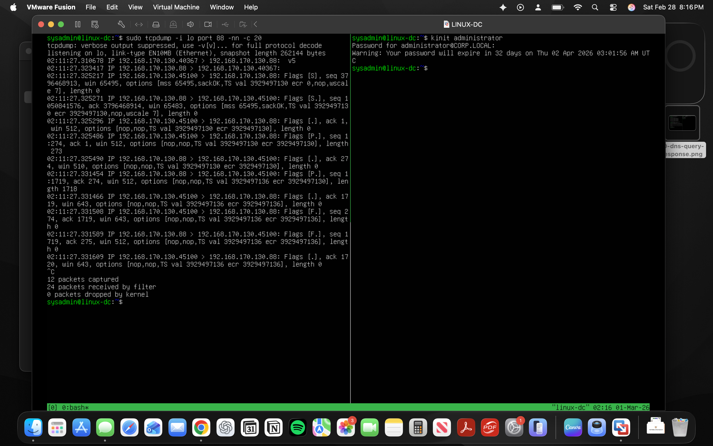

# Kerberos Authentication Flow Analysis (Packet-Level)

## Objective

Capture and analyze Kerberos authentication traffic using tcpdump to understand:

- AS-REQ / AS-REP flow
- UDP to TCP fallback behavior
- TCP flag lifecycle
- Graceful vs abrupt connection termination

---

# Screenshot

---

# Observed Behavior

## 1️⃣ UDP Attempt

Kerberos initially attempted communication over:

UDP port 88

---

## 2️⃣ TCP Fallback

Traffic was then observed over:

TCP port 88

Modern Kerberos implementations switch to TCP when:

- Ticket size exceeds UDP limits
- Additional authentication data increases payload size
- Active Directory environments require larger responses

---

# TCP Session Lifecycle Observed

The following TCP flags were observed:

[S]     – Connection initiated  
[S.]    – SYN-ACK response  
[.]     – Connection established  
[P.]    – Kerberos ticket data transmitted  
[F.]    – Graceful connection termination  

---

## [R] (If observed)

Would indicate:

- Abrupt termination
- Application reset
- Potential scanning or abnormal behavior

---

# Kerberos Authentication Flow (Simplified)

1. Client sends AS-REQ (Authentication Service Request)
2. KDC responds with AS-REP (Ticket Granting Ticket)
3. Ticket is encrypted and returned to client
4. TCP session closes gracefully

No plaintext password is transmitted during this process.

---

# Skills Demonstrated

- Capturing loopback traffic
- Identifying UDP to TCP fallback behavior
- Interpreting TCP flags in authentication flows
- Recognizing normal vs abnormal termination patterns
- Understanding ticket-based authentication mechanisms
