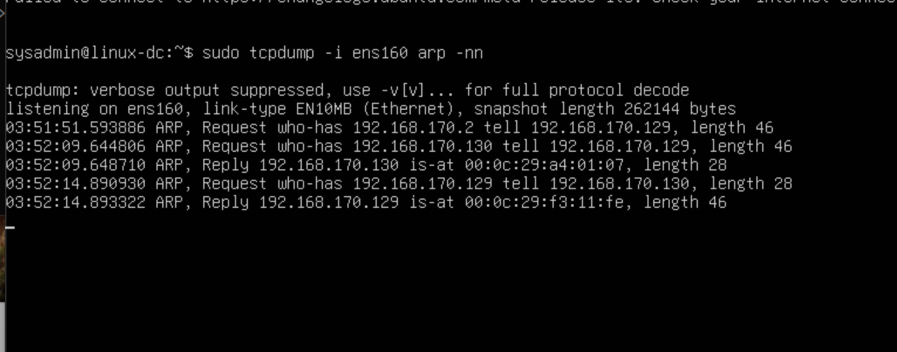
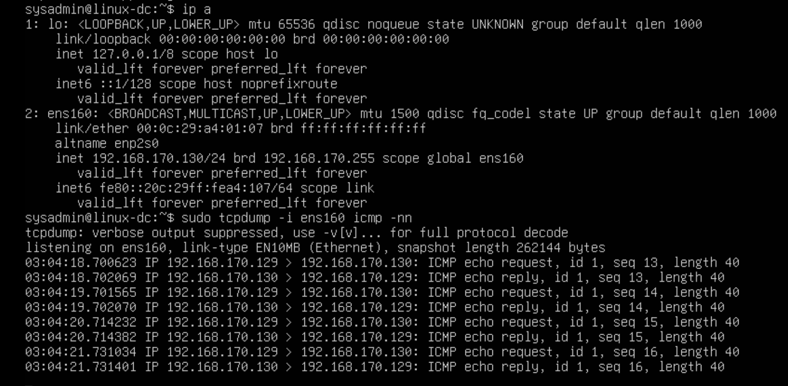
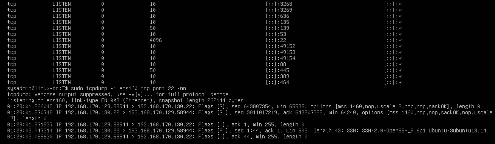

# Packet Analysis with tcpdump – ARP, ICMP, and TCP Handshake

## Objective

Analyze real network traffic across Layers 2–4 using tcpdump in a virtual lab environment.  
This exercise reinforces my practical understanding of:

- ARP resolution (Layer 2)
- ICMP communication (Layer 3)
- TCP three-way handshake (Layer 4)
- Sequence and acknowledgment behavior
- SYN flood mechanics

---

# 1️⃣ ARP Analysis (Layer 2)

## What Was Observed

## Explanation

- Windows did not initially know Linux’s MAC address.
- It broadcasted an ARP request asking for the MAC tied to 192.168.170.130.
- Linux responded with its MAC address.
- Windows stored the IP-to-MAC mapping in its ARP cache.
- Only after this resolution could Layer 3 communication occur.

---

# 2️⃣ ICMP Analysis (Layer 3)

## What Was Observed

## Explanation

- Windows confirmed reachability of Linux.
- Because both systems are in the same /24 subnet, no router was required.
- The ICMP echo request and reply confirmed Layer 3 connectivity.

---

# 3️⃣ TCP Three-Way Handshake (Layer 4)

## What Was Observed

## Handshake Breakdown

1. Client → SYN  
   - Sends initial sequence number  
   - Requests session establishment  

2. Server → SYN-ACK  
   - Acknowledges client sequence + 1  
   - Sends its own initial sequence number  

3. Client → ACK  
   - Acknowledges server sequence + 1  
   - Connection is now established  

After handshake, application data is transmitted.
TCP tracks bytes, not packets.

---

# SYN Flood Concept

- Sending large volumes of SYN packets
- Not completing the handshake
- Forcing the server to allocate resources for half-open connections
- Filling the SYN backlog queue
- Preventing legitimate users from connecting

If spoofed IP addresses are used, mitigation becomes more difficult because the attacker cannot be blocked by a single source IP.

