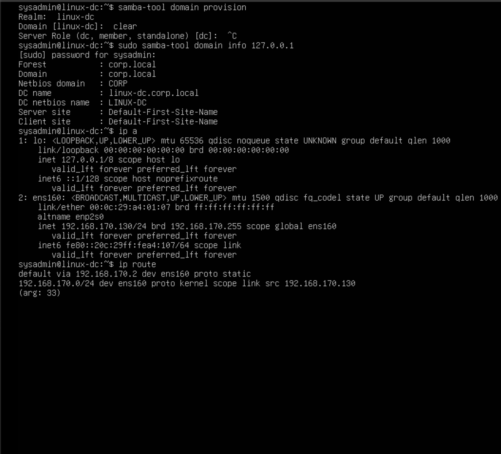

Screenshot:

Observed IP Address:
192.168.170.130/24

Observed Gateway:
192.168.170.2

---

## Subnet Breakdown

CIDR: /24  
Subnet Mask: 255.255.255.0  

Network Address: 192.168.170.0  
Broadcast Address: 192.168.170.255  
Total Addresses: 256  
Usable Hosts: 254 
Valid Host Range: 192.168.170.1 - 192.168.170.254   
